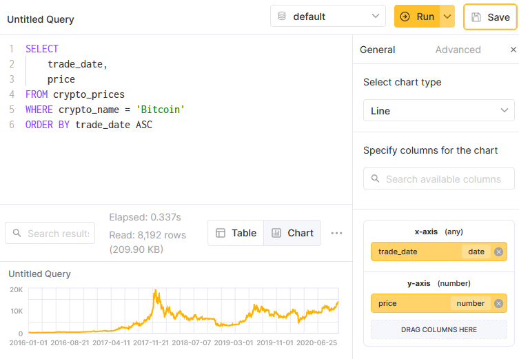
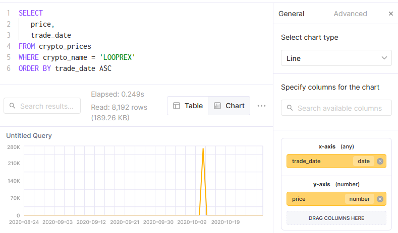

# Lab 4. Running queries

> In this lab, you'll write some queries to analyze the cryptocurrency prices in your crypto_prices table.

## Task 1
Using the SQL Console, write a query that returns the `trade_date` and `price` for each day of 'Bitcoin'. 
Sort the result by `trade_date` ascending so that the oldest date is first.

```sql
SELECT 
    trade_date,
    price
FROM crypto_prices
WHERE crypto_name = 'Bitcoin'
ORDER BY trade_date ASC;

2016-01-01	434.33
2016-01-02	433.44
2016-01-03	430.01
2016-01-04	433.09
2016-01-05	431.96
2016-01-06	429.11
2016-01-07	458.05
2016-01-08	453.23
```

## Task 2
Click the **Chart** button
- Change the chart type from Bar to Line
- Drag `trade_date` to the x-axis
- Drag `price` to the y-axis



## Task 3
Using the `max()` function, write a new query that returns the highest `price` of each `crypto_name`, 
in descending order so that the crypto with the highest price ever traded is the first row in the response.

```sql
SELECT 
   max(price) AS max,
   crypto_name
FROM crypto_prices
GROUP BY crypto_name
ORDER BY max DESC;


15104564000 Travel1Click
2300740     Project-X
270822      LOOPREX
127515      42-coin
107552      Robonomics Web Services
58429.64    Amun Ether 3x Daily Long
...
```

## Task 4
The `change_1_day` column represents the percentage change of the crypto `price` from the previous day. 
Which cryptocurrencies had the largest 1-day increases in `price`, and what day did those increases occur? 
(HINT: Use the `argMax(trade_date, change_1_day)` function to get the `trade_date` when the maximum change occurred.)

```sql
SELECT 
   max(change_1_day) AS max,
   crypto_name,
   argMax(trade_date, change_1_day)
FROM crypto_prices
WHERE crypto_name != ''
GROUP BY crypto_name
ORDER BY max DESC;

234681100   LOOPREX	                        2020-10-12
12873122    Innovative Bioresearch Coin	    2020-05-16
9899999	    Helper Search Token	            2019-02-05
9899999	    Newton Coin Project	            2018-12-10
9899999	    ZeusNetwork	                    2018-12-10
9899999	    RabbitCoin	                    2018-12-13
9899999	    Pandacoin	                    2016-01-05
...
```

## Task 5
Write a query that returns all of the prices of LOOPREX, then display the results in a line graph.

```sql 
SELECT 
   price,
   trade_date
FROM crypto_prices
WHERE crypto_name = 'LOOPREX'
ORDER BY trade_date ASC
```



## Task 6
Which cryptocurrencies lost all of their value in a single day where they had a volume greater than 0? 
(The change_1_day column will have a value of -1 on that particular day.)

```sql
SELECT *
FROM crypto_prices
WHERE crypto_name != ''
    AND change_1_day = -1
    AND volume > 0;

2020-10-10  SHIBA INU   304.04  0           0   -1
2020-10-13  LOOPREX     67.1    0.001489    0   -1    
```

## Task 7
Run this query which returns the worst days for each cryptocurrency, sorted by those with the absolute worst days ever

```sql
SELECT 
   min(change_1_day) AS min,
   crypto_name,
   argMin(trade_date, change_1_day)
FROM crypto_prices
WHERE crypto_name != ''
AND volume > 0
GROUP BY crypto_name
ORDER BY min ASC;

-1          LOOPREX     2020-10-13
-1          SHIBA INU   2020-10-10
-0.9999999  LiteDoge    2016-06-15
-0.9999999  GCN Coin    2017-05-21
-0.9999999  EZOOW       2019-03-05
-0.9999999  Dimecoin    2017-02-16
```