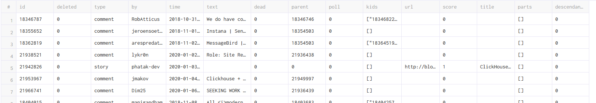
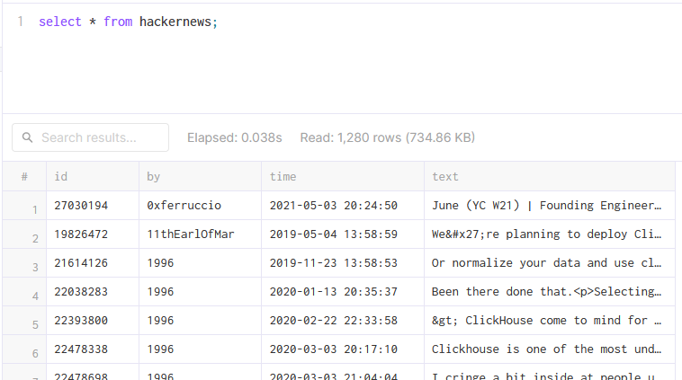

# Lab 2. Creating tables

100 rows from the CSV file
```sql
SELECT * 
FROM 
   url('https://datasets-documentation.s3.eu-west-3.amazonaws.com/hackernews/clickhouse_hacker_news.csv',
  'CSVWithNames')
LIMIT 100;
```


View the schema of the table
```sql
DESCRIBE 
   url('https://datasets-documentation.s3.eu-west-3.amazonaws.com/hackernews/clickhouse_hacker_news.csv',
  'CSVWithNames');
```
```
id          Nullable(Int64)
deleted     Nullable(Int64)
type        Nullable(String)
by          Nullable(String)
time        Nullable(DateTime64(9))
text        Nullable(String)
dead        Nullable(Int64)
parent      Nullable(Int64)
poll        Nullable(Int64)
kids        Array(Nullable(Int64))
url         Nullable(String)
score       Nullable(Int64)
title       Nullable(String)
parts       Nullable(String)
descendants Nullable(Int64)
```

The authors with the most number of comments
```sql
SELECT 
   count() AS count,
   by
 FROM  
   url('https://datasets-documentation.s3.eu-west-3.amazonaws.com/hackernews/clickhouse_hacker_news.csv',
  'CSVWithNames')
GROUP BY by
ORDER BY count DESC;
```
```
78	hodgesrm
45	zX41ZdbW
39	manigandham
35	pachico
27	valyala
25	FridgeSeal
17	PeterZaitsev
...
```

## Task
Create a new table named `hackernews` that only contains the following four columns 
from the clickhouse_hacker_news.csv file: `id`, `by`, `time`, and `text`. 
Use any data type you feel is appropriate for the columns, and use `by` and `time` for the primary key. 
Populate your hackernews table with all the rows in `clickhouse_hacker_news.csv`.

```sql
CREATE TABLE hackernews (
    id UInt32,
    by String,
    time DateTime,
    text String
)
PRIMARY KEY (by, time);

INSERT INTO hackernews 
SELECT id, by, time, toString(text) 
FROM url(
   'https://datasets-documentation.s3.eu-west-3.amazonaws.com/hackernews/clickhouse_hacker_news.csv',
   'CSVWithNames'
);

select * from hackernews;
```



