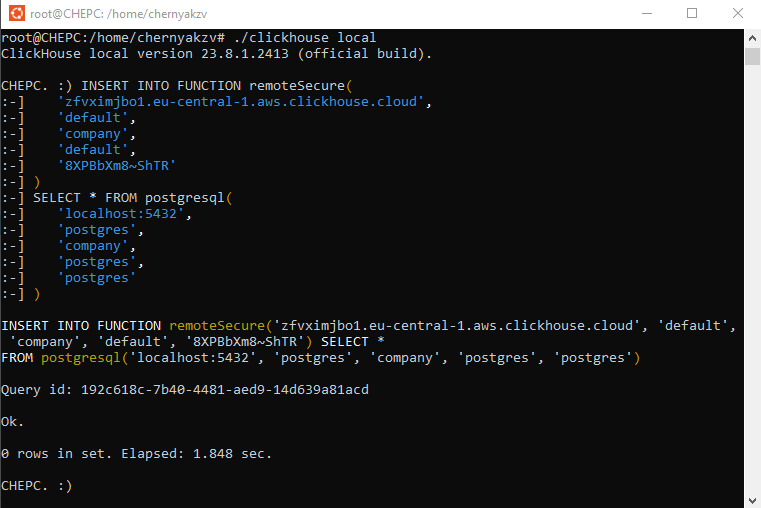

# 4.3 Insert data from an external database

## Step 1
Run PostgreSQL via Docker
```bash
cd ./04_data_ingestion
docker compose up -d
```

Create and fill source table in PostgreSQL
```sql
CREATE TABLE public.company (
	id_comp int NOT NULL ,
	name char (10) NOT NULL 
);

insert into company values(1,'Don_avia  ');
insert into company values(2,'Aeroflot  ');
insert into company values(3,'Dale_avia ');
insert into company values(4,'air_France');
insert into company values(5,'British_AW');
```

## Step 2
Create target table in ClickHouse Cloud
```sql
CREATE TABLE default.company (
	id_comp UInt32,
	name String
)
PRIMARY KEY (name);
```


## Step 3
Install and run tool `clickhouse-local` from ClickHouse binary 
(https://clickhouse.com/docs/en/integrations/sql-clients/clickhouse-client-local)
```bash
# For Windows users: open a shell in WSL 2
bash
curl https://clickhouse.com/ | sh

# Run `clickhouse-local`
./clickhouse local
```

## Step 4
PostgreSQL was running on the same machine as clickhouse-local, 
but it could have easily connected to a remote instance (assuming PostgreSQL is accessible remotely)

Insert data from PostgreSQL to Clickhouse via tool `clickhouse-local`
```sql
INSERT INTO FUNCTION remoteSecure(
   'zfvximjbo1.eu-central-1.aws.clickhouse.cloud',
   'default',
   'company',
   'default',
   '8XPBbXm8~ShTR'
)
SELECT * FROM postgresql(
   'localhost:5432',
   'postgres',
   'company', 
   'postgres',
   'postgres'
)
```


Check result at Clickhouse Cloud
```sql
select * from default.company;
```
```
2	Aeroflot
5	British_AW
3	Dale_avia
1	Don_avia
4	air_France
```
